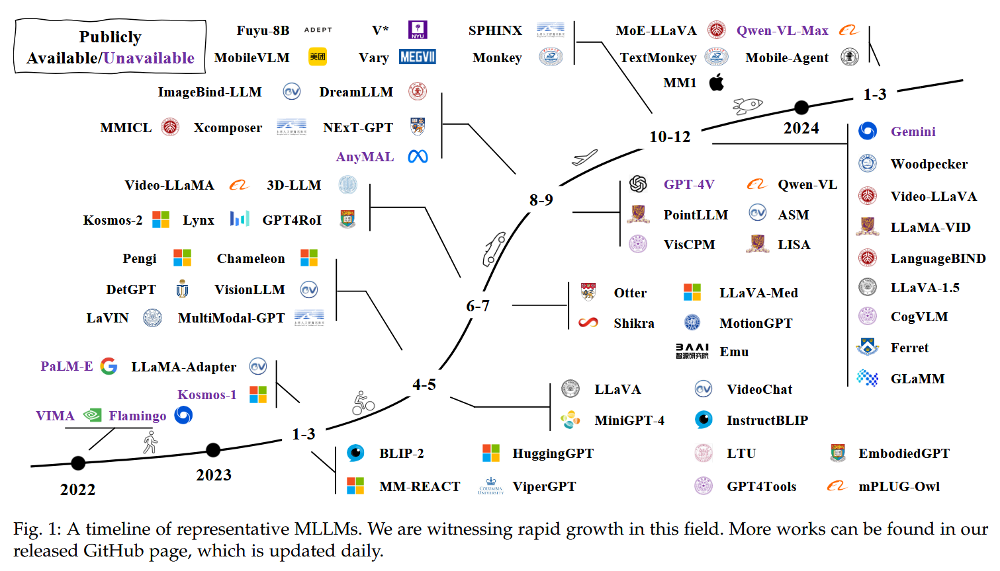
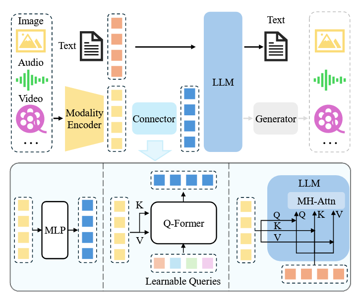
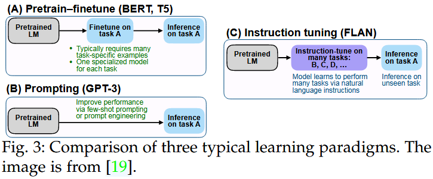
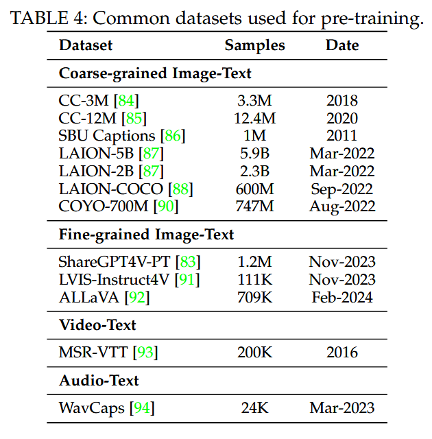
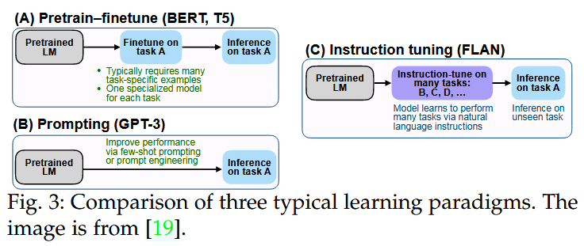
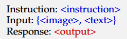
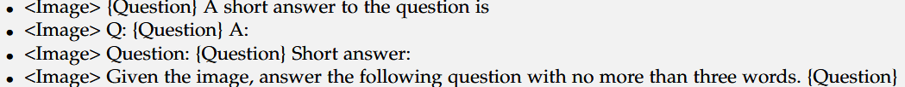

# (2024-04-01) A Survey on Multimodal Large Language Models

|                                                                                                                                                                                                                                                                                                                                                                                                                                                                                                                                                                                                                                                                                                                                                                                                                                                                                                                                                                                                                                                                                                                                                                                                                                                                                                                                                                                                                                                                                                                                                                                                                                                                                                                                                                                                      |
| ---------------------------------------------------------------------------------------------------------------------------------------------------------------------------------------------------------------------------------------------------------------------------------------------------------------------------------------------------------------------------------------------------------------------------------------------------------------------------------------------------------------------------------------------------------------------------------------------------------------------------------------------------------------------------------------------------------------------------------------------------------------------------------------------------------------------------------------------------------------------------------------------------------------------------------------------------------------------------------------------------------------------------------------------------------------------------------------------------------------------------------------------------------------------------------------------------------------------------------------------------------------------------------------------------------------------------------------------------------------------------------------------------------------------------------------------------------------------------------------------------------------------------------------------------------------------------------------------------------------------------------------------------------------------------------------------------------------------------------------------------------------------------------------------------- |
| **Author:** Shukang Yin; Chaoyou Fu; Sirui Zhao; Ke Li; Xing Sun; Tong Xu; Enhong Chen;                                                                                                                                                                                                                                                                                                                                                                                                                                                                                                                                                                                                                                                                                                                                                                                                                                                                                                                                                                                                                                                                                                                                                                                                                                                                                                                                                                                                                                                                                                  |
| **Journal: IEEE TRANSACTIONS ON PATTERN ANALYSIS AND MACHINE INTELLIGENCE (Publication Date: 2024-04-01)**                                                                                                                                                                                                                                                                                                                                                                                                                                                                                                                                                                                                                                                                                                                                                                                                                                                                                                                                                                                                                                                                                                                                                                                                                                                                                                                                                                                                                                                                                                                                                                                     |
| **Journal Tags:**                                                                                                                                                                                                                                                                                                                                                                                                                                                                                                                                                                                                                                                                                                                                                                                                                                                                                                                                                                                                                                                                                                                                                                                                                                                                                                                                                                                                                                                                                                                                                                                                                                                                              |
| **Local Link: **<a href="zotero://open-pdf/0_VWGJ2ZVB" rel="noopener noreferrer nofollow">Yin 等 - 2024 - A Survey on Multimodal Large Language Models.pdf</a>                                                                                                                                                                                                                                                                                                                                                                                                                                                                                                                                                                                                                                                                                                                                                                                                                                                                                                                                                                                                                                                                                                                                                                                                                                                                                                                                                                                                                            |
| **DOI: **<a href="https://doi.org/10.48550/arXiv.2306.13549" rel="noopener noreferrer nofollow">10.48550/arXiv.2306.13549</a>                                                                                                                                                                                                                                                                                                                                                                                                                                                                                                                                                                                                                                                                                                                                                                                                                                                                                                                                                                                                                                                                                                                                                                                                                                                                                                                                                                                                                                                            |
| **Abstract: ***Recently, Multimodal Large Language Model (MLLM) represented by GPT-4V has been a new rising research hotspot, which uses powerful Large Language Models (LLMs) as a brain to perform multimodal tasks. The surprising emergent capabilities of MLLM, such as writing stories based on images and OCR-free math reasoning, are rare in traditional multimodal methods, suggesting a potential path to artificial general intelligence. To this end, both academia and industry have endeavored to develop MLLMs that can compete with or even better than GPT-4V, pushing the limit of research at a surprising speed. In this paper, we aim to trace and summarize the recent progress of MLLMs. First of all, we present the basic formulation of MLLM and delineate its related concepts, including architecture, training strategy and data, as well as evaluation. Then, we introduce research topics about how MLLMs can be extended to support more granularity, modalities, languages, and scenarios. We continue with multimodal hallucination and extended techniques, including Multimodal ICL (M-ICL), Multimodal CoT (M-CoT), and LLM-Aided Visual Reasoning (LAVR). To conclude the paper, we discuss existing challenges and point out promising research directions. In light of the fact that the era of MLLM has only just begun, we will keep updating this survey and hope it can inspire more research. An associated GitHub link collecting the latest papers is available at https://github.com/BradyFU/Awesome-Multimodal-Large-Language-Models.* |
| **Note Date: **2024/9/3 19:49:52                                                                                                                                                                                                                                                                                                                                                                                                                                                                                                                                                                                                                                                                                                                                                                                                                                                                                                                                                                                                                                                                                                                                                                                                                                                                                                                                                                                                                                                                                                                                                         |

## 🔁 Research Content

***

> Tips: What was done, what problem was solved, innovations and shortcomings?

### ⚙️ Authors’ Information

Chaoyou Fu 腾讯优图实验室 [bradyfu24@gmail.com](bradyfu24@gmail.com)

Shukang Yin和Sirui Zhu 中国科学技术大学数据科学系 [sirui@mail.ustc.edu.cn](sirui@mail.ustc.edu.cn)

### ⚙️ Background

*   基本概念

    *   架构 architecture
    *   训练策略 training strategy
    *   数据 data
    *   评估 evaluation

*   如何扩展 MLLM 以支持更多研究主题：

    *   粒度 granularity （模型处理信息的细致程度或层次）
    *   模式 modalities （输入输出格式，图像  视频  音频  点云）
    *   语言 languages （例如中文支持）
    *   场景 scenarios （例如医学图像理解或文档解析）

*   幻觉和一些扩展技术：

    *   hallucination
    *   Multimodal ICL (M-ICL)
    *   Multimodal CoT (M-CoT)
    *   LLM-Aided Visual Reasoning (LAVR)

*   LLM新兴能力

    *   指令遵循 instruction following
    *   情境学习 InContext Learning (ICL)
    *   思维链 Chain of Thought (CoT)

*   最新论文的相关 GitHub 链接位于

    *   <https://github.com/BradyFU/Awesome-Multimodal-Large-Language-Models>

### ⚙️ Q\&A

### ⚙️ Structure

1.  Introduction
2.  Architecture
3.  Training Strategy and Data
4.  Evaluation
5.  Extensions
6.  Hallucination
7.  Extended Techniques

### ⚙️ Content

***

## 1 背景

LLMs 随着模型规模 和 数据集规模 提升，能力也在提升。

但 LLMs 视觉能力弱，反之 LVMs 视觉能力强，推理能力弱。

两者结合形成 MLLMs ，从形式上来说，它是指基于LLM的模型，具有接收、推理和输出多模态信息的能力。

MLLMs 使用新的训练范式。

 

## 2 架构

典型三模块：

*   预训练模态编码器 pre-trained modality encoder

*   预训练LLM   pre-trained LLM

*   模态接口 modality interface to connect them 

*   可能）生成器 generator 用于输出其他模态

encoders类似于获取表征的人体器官，LLM类似于处理信息的大脑。

### 2.1 模态编码器

起到compress raw information的作用。

一般使用与其他模式对齐的预训练编码器，例如CLIP视觉编码器结合图像-文本对。

输入：

*   一般高分辨率会更好。
*   directly scaling 直接输入高分辨对象。通常需要改进encoder， 例如双encoder，一个支持高分辨率，一个低分辨率；通过交叉注意将高分辨率特征注入低分辨率分支。
*   patch-division 分块输入。将1、高分辨率图片分割成小patch；2、降采样的原图 输入低分辨率encoder，前者关注局部特征，后者关注全局特征。

对于parameter size 、trainging data composition来说，没有input resolution那么重要。

## 2.2 预训练LLMs

Mixture of Experts，MoE 架构具备了**稀疏激活**的特点（与传统密集模型相比），使得即便总参数量增加，也不会显著提升计算成本。其主要原理是根据需要**选择性激活**部分参数，而不是在每个推理步骤中激活所有参数。性能更加优秀。

## 2.3 多模态连接器

鉴于直接训练end2end多模态大模型过于艰难，不现实，所以有两种可行方法：

*   训练一个learnable connector — 模块化设计，只需训练连接器。
*   通过expert model如视觉专用模型，把图像直接转化为语言描述（如生成图像的文字说明），完全绕过了多模态。

### 2.3.1 Learnable Connector

**token-level fusion** 的效果更好，尤其在VQA任务中，而模态适配器的设计影响较小。

**feature-level fusion** 和 cross-attention模型在性能上可能稍逊，需要复杂的超参数优化来缩小差距。

*   token level fusion

    *   基于learnable query tokens的融合

        *   encoder输出特征- 转化为tokens- 与文本tokens拼接- 一起输入LLM
        *   查询token机制：使用一组learnable query tokens，以查询的方式从视觉特征中提取信息。cite-BLIP-2
        *   类似于BLIP-2中的Q-Former 压缩视觉tokens为少量的表示向量，避免大量冗余原始特征输入LLM

    *   基于MLP的简单接口

        *   使用MLP来链接不同模态之间的差距。

*   feature level fusion

    *   插入跨模态模块（跨模态注意力层，专家模块）

    *   参数量小 - 例如，**Qwen-VL**中的Q-Former的参数量只有0.08B，占整个模型参数量的不到1%，而编码器占19.8%（1.9B），LLM占80.2%（7.7B）。

*   专家模型

    *   工作原理：专家模型的基本思路是利用预训练的模型（如**图像描述生成模型**）将多模态输入转换为**语言形式**，使得LLMs可以通过这些语言描述来理解多模态数据。也就是说，不需要重新训练多模态模型，而是将不同模态的信息（如图像、视频）转换成LLM可以直接处理的文本。

    *   缺点是存在信息丢失，扭曲时空关系，无法捕捉重要细节。

 

## 3 训练

一个完整的多模态LLM训练通常分为三个阶段：

*   预训练 pre-training
*   指令调优 instruction-tuning
*   对齐调优 alignment-tuning

目的：

（1）调整不同的模式和（2）提供世界知识（其他模态）

### 3.1 pre-training

At the first training stage：协调不同模态，通常需要大量文本匹配其他模态的数据。

例如 给定图像，模型经过训练，预测图像的标题。（遵循标准交叉熵损失自回归）

预训练的常见方法是保持预训练模块（例如视觉编码器和 LLM）冻结并训练可学习的 interface --- 不丢失预先训练的知识的情况下协调不同的模式。

> 冻结，即不对预先训练好的模型部分（如视觉编码器或大语言模型）进行进一步的权重更新。不丢失预先训练的知识。
>
> 可以根据需要解冻部分模块（例如视觉编码器）以启用更多可训练参数进行对齐。

训练方案与数据质量密切相关。

*   对于较短且有噪声的字幕数据，可以采用较低的分辨率（例如 224）来加快训练过程，
*   对于较长且更清晰的数据，最好使用较高的分辨率（例如 448 或更高）来减轻幻觉。
*   此外，ShareGPT4V \[83]发现，在预训练阶段使用高质量的字幕数据，解锁视觉编码可以促进更好的对齐。

### 3.1.1 数据

预训练语料按照粒度可以分为粗粒度和细粒度数据

粗粒度的字幕数据具有一些典型的共同特征：

*   因为样本通常来自互联网。

*   由于网络潦草的性质，标题通常简短且嘈杂，因为它们源自网络图像的替代文本。

    *   这些数据可以通过自动工具进行清理和过滤，例如使用CLIP\[13]模型过滤掉相似度低于预定义阈值的图像文本对。

细粒度

通常包含更长、更准确的图像描述，从而实现图像和文本模态之间更细粒度的对齐。但由于这种方式一般需要调用商用的MLLM，成本较高，数据量也相对较小。

### 3.2 instruction-tuning指令调优

instruction-tuning 和 related typical learning 的区别如下：

instruction是**任务**的描述。

*   目的：教会模型更好地理解用户的指令并完成所需的任务。

    *   借此，LLM 可以通过遵循新指令泛化到未见过的任务，从而提高零样本性能。这个简单而有效的想法引发了后续 NLP 工作的成功

*   指令样本

    *   三元组 triplet form $(\mathcal{I},\mathcal{M},\mathcal{R})$ instruction，multimodal input，ground truth response。

    *   MLLM 预测答案：$\mathcal{A}=f(\mathcal{I},\mathcal{M};\theta)$A表示预测答案，θ是模型的参数。

    *   损失函数：$$ $\mathcal{L}(\theta)=-\sum_{i=1}^N\log p(\mathcal{R}_i|\mathcal{I},\mathcal{R}_{ $$

*   基本格式：

### 3.2.1 指令数据集

*   data adaptation 数据适应

    *   以特定任务为目标的数据集往往高质量

    *   例：VQA，Visual Question Answering数据集转换。

        *   原始样本：输入输出对；输入包括图像和NLP问题，输出为针对图像的该问题答案。
        *   指令都是一些简单的描述，类似：
        *   这些指令可以人工给出也可以由gpt辅助半自动生成
        *   VQA可能会产生回答过短的问题，目前也有一些解决方案。

*   self-instruction 自指令（自学）

    *   手工制作一些指令样本作为演示，之后提示 ChatGPT/GPT-4 以演示为指导生成更多指令样本。

    *   在多模态领域就形成了一个MLLM数据集，如

        *   LLaVA-Instruct-150k/ LVIS-Instruct4V/ ALLaVA
        *   MiniGPT-4
        *   ChatBridge
        *   GPT4Tools
        *   DetGPT

*   data mixture 数据混合

    *   就是把纯语言数据掺杂到多模态数据集中形成混合数据集。
    *   MultiInstruct

*   数据质量

    *   研究表明，大规模有噪声的数据集一定程度上<较小且干净的数据集。下面指出两个与质量相关的指标
    *   Prompt Diversity
    *   Task Coverage 某研究发现视觉推理任务在提高模型性能方面优于字幕和 QA 任务。

### 3.3 Alignment tuning 对齐调优

Alignment tuning 更常用于**模型**需要与特定**人类偏好**保持**一致**的场景，例如fewer hallucinations减少幻觉。两种方案：

*   Reinforcement Learning with Human Feedback（RLHF）

    *   利用RL使LLM与人类偏好相同

*   Direct Preferecne Optimization（DPO）

    *   利用简单的二元分类损失从人类偏好标签中学习--两步，人类偏好数据收集和偏好学习

## 4 Evaluation 评估

与LLM相比，MLLM的evaluation 需要额外考虑评估的

*   全面性 -- MLLMs 有通用性
*   新功能 -- 例如无 OCR 的数学推理
*   generally 两类：封闭集，开放集

### 4.1 Closed-set questions

答案∈预定义的集合

*   评估方法通常 -- benchmark metrics

    *   例如 **准确率 **和 **CIDEr得分**

*   样本设置

    *   **零样本**（未见过的任务或数据集上进行测试）

        *   一般：涵盖不同一般任务的广泛数据集

    *   **微调** （模型先在特定领域或任务上进行微调，再在同一任务上进行测试，评估其微调后的表现）

        *   一般：特定领域任务的评估

*   面向大范围的**新基准**

    *   **MME：**综合评估标准，共包括14个感知和认知任务
    *   **MMBench：** 专门为评估模型功能的**多个维度**而设计的基准，使用 ChatGPT 将开放响应与预定义的选择进行匹配
    *   **POPE：** 评估**幻觉**程度
    *   Video-ChatGPT和Video-Bench专注于视频领域，并提出专门的基准测试以及评估工具

### 4.2 Open-set questions

更加灵活。大致分为：

1.  **人工评分**：由**人类评估**生成的回答，通常涉及**手工设计的问题来评估特定能力**。
2.  **GPT评分**：一些研究**使用GPT**进行自动评分，用于多模态对话的评估。例如LLaVA 关注回答的有用性和准确性。**模型生成的答案和GPT-4生成的答案都会被送回GPT-4进行比较。**
3.  **案例研究**：通过特定案例对模型进行深入分析和评估，以了解模型在特定情境下的表现。

## 5 Extensions

更强大的**基础能力**到更广泛的**场景覆盖范围**。

*   **Granularity Support 粒度支持**。进行更精细控制的模型
*   **Modality Support 模式支持**。
*   **Languge Support 语言支持**。
*   **Scenario/ Task Extension 场景/任务扩展**。

## 6 Multimodal Hallucination 多模态幻觉

MLLM产生的幻觉与LLM类似，只是多了其他模态，如图像。

几种基本形式：

*   Existence Hallucination 如错误地声称图像中某些物体存在
*   Attribute Hallucination 属性幻觉，如红苹果说成蓝苹果
*   Relationship Halluciantion 关系幻觉，比如a在b上方的描述错误

### 6.1 幻觉评估

目前有已下很多评估标准.

*   CHAIR：一种标准, 早期用于评估开放式字幕中的幻觉水平。衡量了有幻觉的句子在所有对象中的比例。

*   POPE

*   MME

*   HaELM

### 6.2 减轻幻觉的方法

三种思路:

*   pre-correction 事前矫正

    *   收集**专门的数据** (例如,** 负面示例或错误示例**)，并使用该数据进行微调，从而得到幻觉响应较少的模型。
    *   相关研究包括 LRV-Instruction, LLaVA-RLHF

*   inprocess-correction 事中矫正

    *   在**架构设计**或**特征表达**上做出改进。这些作品试图探究产生幻觉的原因，并在产生过程中设计相应的补救措施来缓解幻觉。

    *   HallE-Switch 假设**existence hallucinations**可能是基于**LLM中的已有知识推断出来的**

    *   VCD认为幻觉来源于**statistical bias** in training corpus 训练语料**统计偏见**, 和**strong language prior** embedded in LLMs **强语言先验**

        *   作者注意到，当向图像中注入噪声时，MLLMs倾向于偏向于语言先验而不是图像内容来生成响应，从而导致幻觉。

    *   HACL 设计了一种对比学习方案，在拉近成对的跨模态representation的同时，推开幻觉化的文本。

*   post-correction 事后矫正

    *   事后补救
    *   pecker 免训练框架结合专家模型来补充上下文信息, 纠正幻觉
    *   LURE 训练了一个revisor去mask可能是幻觉的对象

## 7 Extended Techniques

### 7.1 Multimodal In-Context Learning 语境学习

*   supervised learning: 从大量数据中学习隐藏模式

*   ICL(In-Context Learning):

    *   从类比中学习 -- 从几个例子中学习, 推广到新问题
    *   通常免训练, 可以灵活集成
    *   与instruction-tuning密切相关

ICL 在MLLMs 中如何实现: 可以在inference time 加入一个demonstration set (ICL set).

*   ICL性能 on MLLM

    *   MIMIC-IT 构建指令数据集,ICL结合instruction tuning.
    *   Emu 扩展了更多模态

*   ICL应用

    *   解决各种视觉推理任务
    *   教 MLLM 使用外部工具 （粒度更细）

### 7.2 多模态CoT思维链

 CoT 即LLM输出一系列推理步骤以及答案

 

### 📜 Conclusion

 

## 🤔 Personal Summary

***

> Tips: What aspects did you question, how do you think it can be improved?

 

### 🙋‍♀️ Key Records

 

### 📌 To be resolved

 

### 💭 Thought Inspiration

 
