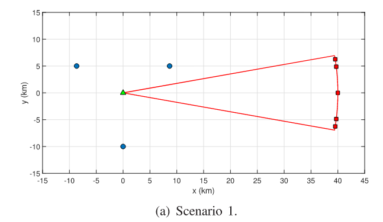
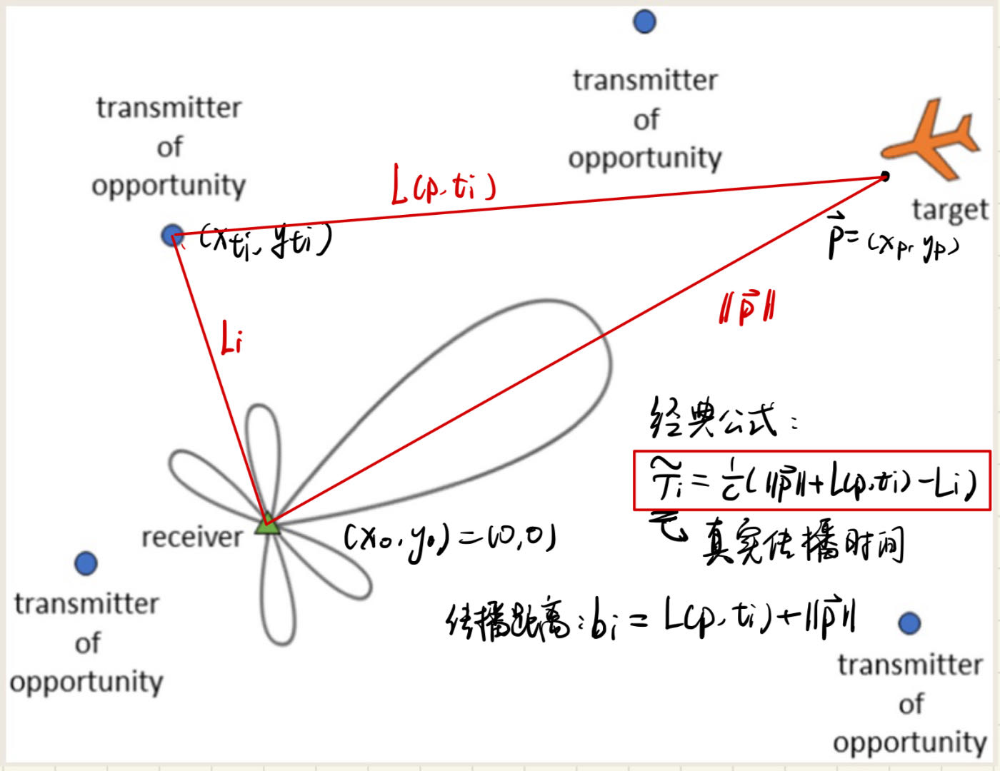
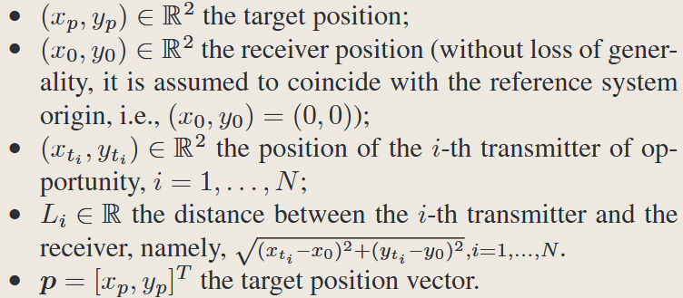
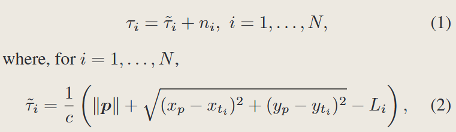
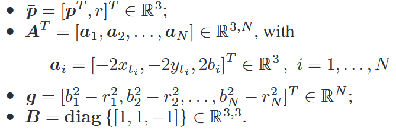
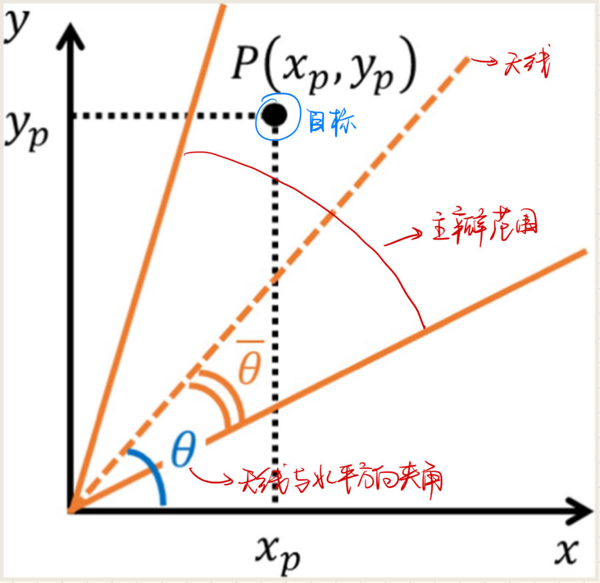
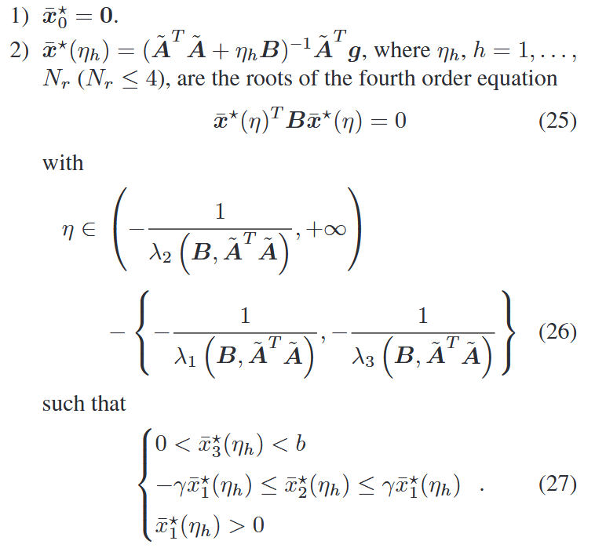
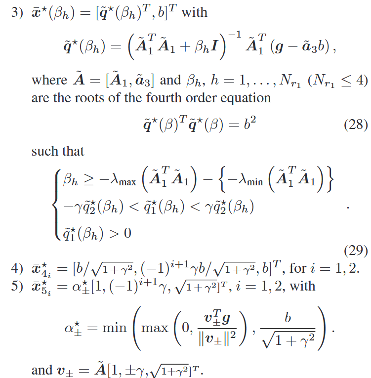
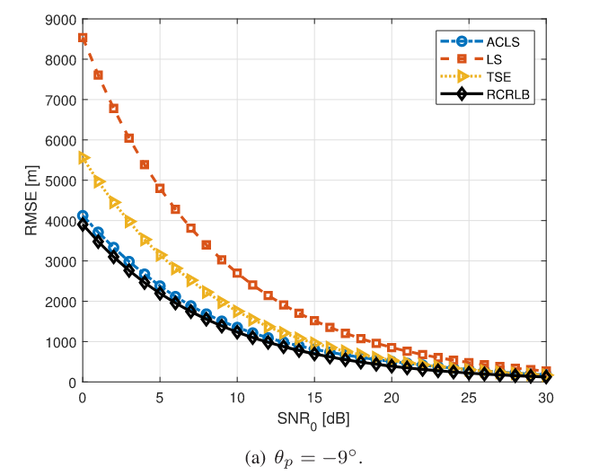

# (2020) Localization in 2D PBR With Multiple Transmitters of Opportunity: A Constrained Least Squares Approach

|                                                                                                                                                                                                                                                                                                                                                                                                                                                                                                                                                                                                                                                                                                                                                                                                                                                                                                                                                                                                                                                                                                                               |
| ----------------------------------------------------------------------------------------------------------------------------------------------------------------------------------------------------------------------------------------------------------------------------------------------------------------------------------------------------------------------------------------------------------------------------------------------------------------------------------------------------------------------------------------------------------------------------------------------------------------------------------------------------------------------------------------------------------------------------------------------------------------------------------------------------------------------------------------------------------------------------------------------------------------------------------------------------------------------------------------------------------------------------------------------------------------------------------------------------------------------------- |
| **Author:** Augusto Aubry; Vincenzo Carotenuto; Antonio De Maio; Luca Pallotta;                                                                                                                                                                                                                                                                                                                                                                                                                                                                                                                                                                                                                                                                                                                                                                                                                                   |
| **Journal: IEEE Transactions on Signal Processing (Publication Date: 2020)**                                                                                                                                                                                                                                                                                                                                                                                                                                                                                                                                                                                                                                                                                                                                 |
| **Journal Tags:**                                                                                                                                                                                                                                                                                                                                                                                                                                                                                                                                                                                                                                                                                                                                                                                                                                                                                                                                                                                                       |
| **Local Link: **<a href="zotero://open-pdf/0_XQCLKE2A" rel="noopener noreferrer nofollow">Aubry 等 - 2020 - Localization in 2D PBR With Multiple Transmitters of Opportunity A Constrained Least Squares Approa.pdf</a>                                                                                                                                                                                                                                                                                                                                                                                                                                                                                                                                                                                                                                                                                            |
| **DOI: **<a href="https://doi.org/10.1109/TSP.2020.2964235" rel="noopener noreferrer nofollow">10.1109/TSP.2020.2964235</a>                                                                                                                                                                                                                                                                                                                                                                                                                                                                                                                                                                                                                                                                                                                                                                                       |
| **Abstract: ***A new algorithm for Passive Bistatic Radar (PBR) localization exploiting multiple illuminators of opportunity is proposed. To capitalize a-priori information on the receiving antenna main-lobe extent, specific constraints are forced to the target localization process. At the estimator design process the elliptic positioning problem is formulated according to the constrained Least Squares (LS) framework. Hence, the resulting non-convex optimization problem is globally solved providing a closed-form estimate to the target Cartesian coordinates. At the analysis level, the performance of the new estimator is assessed in terms of Root Mean Square Error (RMSE) behavior. The results highlight that interesting MSE improvements with respect to some counterparts available in the open literature can be achieved especially at low Signal to Noise Ratio (SNR) values.* |
| **Note Date: **2024/8/31 20:13:39                                                                                                                                                                                                                                                                                                                                                                                                                                                                                                                                                                                                                                                                                                                                                                                                                                                                                 |

## 📜 Research Core

***

> Tips: What was done, what problem was solved, innovations and shortcomings?

 

### ⚙️ Authors’ Information

A. Aubry, V. Carotenuto, and A. De Maio are with the Università degli Studi di Napoli “Federico II,” DIETI, I-80125 Napoli, Italy

L. Pallotta was with the CNIT udr Università “Federico II,” I-80125 Napoli, Italy. He is now with the Department of Engineering, University of Roma Tre, 00146 Rome, Italy (e-mail: luca.pallotta\@uniroma3.it).

（通讯作者：Antonio De Maio）

### ⚙️ Background

*   **机会照明源（illuminators of opportunity, IOs）**：随处可见、不需特意控制、可以发射电磁波、非专门为雷达系统设置的设备或自然现象。如广播、通信等。

*   **机会辐射源（Transmitters of opportunity, TOs）**：类似IOs

*   **椭圆定位**：通过测量目标与多个基站之间的距离（或到达时间），并利用这些距离信息来确定目标在二维平面上的位置。之所以称为“椭圆定位”，是因为在二维平面中，当我们已知目标到两个基站的距离时，目标的可能位置就落在以这两个基站为焦点的两个椭圆的交点上。

*   **无源双基地雷达（Passive Bistatic Radar，PBR）**：无源雷达集合 含于双基地雷达集合，所以无源雷达也可以叫无源双基地雷达。

    *   双基地雷达：发射和接收天线分置不同位置。
    *   无源雷达（被动雷达）不发射自己的电磁波，而是利用现有的无线电信号源（如广播电视塔、手机基站等）作为照明源，接收目标的反射信号。

*   **互相关信号计算**：

    *   信号模型：$r(t)=\alpha_is_i(t-\tau_i)+n(t)$

        *   $\alpha_{i}$

            是衰减因子

        *   是信号从发射源 i 到目标再到接收站的时间延迟

        *   n(t) 是接收信号中的噪声

    *   互相关函数定义：

        *   互相关函数 $R_{sr}(\tau)$ 定义为发射信号$s_i(t)$ 与接收信号$r(t)$的互相关：

        *   $R_{sr}(\tau)=\int_{-\infty}^\infty s_i(t)r(t+\tau)\:dt$

        *   找到峰值位置${\tau}_{i}$即可得到时间延迟。

 

### ⚙️ Q\&A

略

### ⚙️ Structure

*   第一章：Introduction

*   第二章：Model

*   第三章：求解方案

*   第四章：其他定位方案介绍

*   第五章：实验

*   第六章：结论

 

### ⚙️ Content

问题：优化无源定位效果。场景来自市场，许多 PBR 系统采用圆形阵列天线的观察，该天线在给定主瓣尺寸的方位角上进行扫描。

方法：提出利用多个**机会照明源 (illuminators of opportunity, IOs) **的**无源双基地雷达（Passive Bistatic Radar，PBR）**进行的椭圆定位新算法。

效果：与1 无约束 LS 定位解决方案、2 通过迭代算法估计目标位置的两步估计 (TSE) 程序 \[14] 以及3 目标笛卡尔上的 CRLB 进行比较，评估模型性能。

设备：基于 PBR 的定位使用双基地目标距离测量来完成，需要收集了由一个/多个IOs传输的信号产生的目标回波。为此，PBR 接收器为每个发射器配备了两个接收通道：一个用于从所选发射器获取**直接路径信号**，另一个用于收集感应**回波**。

文章结构：

*   第一章：简介
*   第二章：介绍模型
*   第三章：求解方法
*   第四章：介绍其他文献模型
*   第五章：性能比较
*   第六章：结论与展望

### 💡 Innovations

*   **将定位问题（非凸优化）转化为一个受约束constrained的最小二乘（Least Squares，LS）估计问题。**
*   约束：接收**天线主瓣范围的先验信息**，在定位过程中施加特定约束。
*   通过**广义信赖域子问题（Generalized Trust Region Subproblems，GTRS）理论**，给出了一个**闭式解**，实现了高效的求解。

### 🧩 Shortcomings

 合成信号？

## 🔁 Research Content

***

 

### 💧 Data

 合成信号。场景搭建如下：

 

### 👩🏻‍💻 Method

***

## 1 模型

### 1.1 基本框架

场景/设备：利用多个TOs的 2D 无源双基地雷达，以及一个target

以下列各个元素之间的关系构成的一个**不等式组**作为模型的基本框架。

首先  根据  **经典的基于互相关cross-correlation的信号处理** 接收信号与预先知道的发射信号之间的互相关函数，互相关函数的峰值位置对应于两者之间的时间差

即 TOi 到 Reciver 的时间延迟（时间差 $\tilde{\tau}_i$），借此求解目标位置。

引入反射信号的实际传播距离bi

$b_i=\tilde{\tau}_ic+L_i, \:i=1,\ldots,N\:,$

加上一些基本约束，得到下面不等式组：

$\begin{cases}b_i^2+r^2-2b_ir=r^2+r_i^2-2x_{t_i}x_p-2y_{t_i}y_p,\\r\leq b_i\quad i=1,\ldots,N,\\r=\sqrt{x_p^2+y_p^2}\end{cases}$

用矩阵形式表示：

$\begin{cases}A\bar{p}-g=0\\\bar{p}^TB\bar{p}=0\\\bar{p}_3\leq b_i,i=1,\ldots,N&\end{cases}$

 

### 1.2 Receiver Antenna Main-Lobe Extent Constraint 接收天线主瓣约束

*   根据先验信息--target位于主瓣范围内。根据一些推导，得到：

$-\tan\bar{\theta}\leq\frac{y_p\cos\theta-x_p\sin\theta}{x_p\cos\theta+y_p\sin\theta}\leq\tan\bar{\theta}.$

*   为了简化表示，旋转参考系，使天线方向对齐x轴，记为x1

$\bar{\boldsymbol{R}}(\theta)=\begin{bmatrix}\cos\theta&\sin\theta\\-\sin\theta&\cos\theta\end{bmatrix},$

*   约束公式经过旋转变为$-\tan\bar{\theta}\leq\frac{y_{1p}}{x_{1p}}\leq\tan\bar{\theta},$

*   总结一下上面公式，并再次化简

$\begin{cases}-x_{1p}\gamma\leq y_{1p}\leq x_{1p}\gamma\\x_{1p}\geq0\\\begin{bmatrix}x_{1p}\\y_{1p}\end{bmatrix}=\bar{\boldsymbol{R}}(\theta)\begin{bmatrix}x_p\\y_p\end{bmatrix}\end{cases}$

 

## 2 解决方案

### 2.1 问题提出

考虑到实际测量存在误差，上述公式可以采用Constrainted LS框架建模为：

$\begin{cases}\min_{{\bar{\boldsymbol{p}}}}&\|A\bar{p}-g\|^{2}\\\mathrm{s.t.}&\bar{p}^{T}B\bar{p}=0\\&0\leq\bar{p}_{3}\leq b&&\end{cases}$

引入主瓣约束并化简，得到问题 $\mathcal{P}$ 的最终表示形式：

$\mathcal{P}=\begin{cases}\min_{\tilde{\boldsymbol{p}}}&\left\|\tilde{A}\tilde{p}-g\right\|^2\\\text{s.t.}&\tilde{p}^TB\tilde{p}=0\\&0\leq\tilde{p}_3\leq b\\&-\tilde{p}_1\gamma\leq\tilde{p}_2\leq\tilde{p}_1\gamma\\&\tilde{p}_1\geq0\end{cases}$

其中旋转矩阵：$U=\begin{bmatrix}\bar{R}(\theta)^{T}&0\\0&1\end{bmatrix}$，$\tilde{A}=AU$

### 2.2 问题求解

上述问题是一个非凸优化问题问题。

输入：$\tau_i,L_i,(x_{t_i},y_{t_i}),i=1,\ldots,N;$

输出：Target location estimate $(\hat{x}_p,\hat{y}_p);$

根据上述公式，大部分参数可以直接根据输入计算得到。

***

作者经过证明，该问题的解集（可能的极小值点的集合）可以用一个**有限点集表示**，点集可以用**若干组方程**表示，故只需要解表示出的**方程**即可解出该问题的解。

方程如下：

***

最终解的表现形式如下：

$\begin{aligned}&\bar{x}^\star=\begin{cases}0&\mathrm{if~}i^\star=1\\\bar{x}^\star(\eta_{i^\star})&\mathrm{if~}2\leq i^\star\leq N_r+1\\\bar{x}^\star(\beta_{i^\star})&\mathrm{if~}i^\star\geq N_r+2\mathrm{~and}\\&i^\star\leq N_r+N_{r_1}+1\\\bar{x}_{4_i*}^\star&\mathrm{if~}i^\star=N_r+N_{r_1}+2\mathrm{~or}\\&i^\star=N_r+N_{r_1}+3\\\bar{x}_{5_i*}^\star&\mathrm{if~}i^\star=N_r+N_{r_1}+4\mathrm{~or}\\&i^\star=N_r+N_{r_1}+5&\end{cases}\end{aligned}$kk

选取误差最小的解即可求出最终结果：

$(\hat{x}_p,\hat{y}_p)=(\bar{x}_1^\star,\bar{x}_2^\star).$

 

***

证明的主要思想是确定在特定问题约束定义的子集中寻找候选最优解。

 

### 🔬 Experiment

 

 在上述场景下合成数据进行实验。

### 📜 Conclusion

与

1 无约束 LS 定位解决方案；

2 通过迭代算法估计目标位置的两步估计 (TSE) 程序 ；

3 目标笛卡尔上的 CRLB

进行比较，证明了所提出的算法与公开文献中可用的其他算法相比的有效性（RMSE 值低），特别是对于低信噪比。验证了接收天线主瓣范围的额外限制所带来的好处。文章所获得的结果与**理论 CRLB 的值**非常接近。

另外，该角度越接近主瓣边界，效果越好。（先验更有价值）

## 🤔 Personal Summary

***

> Tips: What aspects did you question, how do you think it can be improved?

 

### 🙋‍♀️ Key Records

 

### 📌 To be resolved

 

### 💭 Thought Inspiration

 
