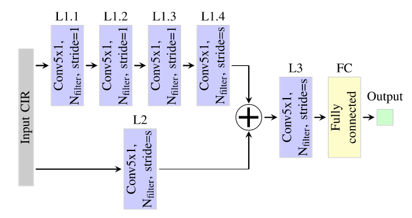

# (2023-12) ToA and TDoA Estimation Using Artificial Neural Networks for High-Accuracy Ranging

|                                                                                                                                                                                                                                                                                                                                                                                                                                                                                                                                                                                                                                                                                                                                                                                                                                                                                                                                                                                                                                                                                                                                                                                                                                                                                                                                                                                                                                                                                                                                                                                                                                              |
| -------------------------------------------------------------------------------------------------------------------------------------------------------------------------------------------------------------------------------------------------------------------------------------------------------------------------------------------------------------------------------------------------------------------------------------------------------------------------------------------------------------------------------------------------------------------------------------------------------------------------------------------------------------------------------------------------------------------------------------------------------------------------------------------------------------------------------------------------------------------------------------------------------------------------------------------------------------------------------------------------------------------------------------------------------------------------------------------------------------------------------------------------------------------------------------------------------------------------------------------------------------------------------------------------------------------------------------------------------------------------------------------------------------------------------------------------------------------------------------------------------------------------------------------------------------------------------------------------------------------------------------------- |
| **Author:** Anil Kirmaz; Taylan Şahin; Diomidis S. Michalopoulos; Wolfgang Gerstacker;                                                                                                                                                                                                                                                                                                                                                                                                                                                                                                                                                                                                                                                                                                                                                                                                                                                                                                                                                                                                                                                                                                                                                                                                                                                                                                                                                                                                                                                 |
| **Journal: IEEE Journal on Selected Areas in Communications (Publication Date: 2023-12)**                                                                                                                                                                                                                                                                                                                                                                                                                                                                                                                                                                                                                                                                                                                                                                                                                                                                                                                                                                                                                                                                                                                                                                                                                                   |
| **Journal Tags:**                                                                                                                                                                                                                                                                                                                                                                                                                                                                                                                                                                                                                                                                                                                                                                                                                                                                                                                                                                                                                                                                                                                                                                                                                                                                                                                                                                                                                                                                                                                      |
| **Local Link: **Kirmaz 等 - 2023 - ToA and TDoA Estimation Using Artificial Neural Networks for High-Accuracy Ranging.pdf                                                                                                                                                                                                                                                                                                                                                                                                                                                                                                                                                                                                                                                                                                                                                                                                                                                                                                                                                                                                                                                                                                                                                                                                                                                                                                                                                                                                               |
| **DOI: **10.1109/JSAC.2023.3322803                                                                                                                                                                                                                                                                                                                                                                                                                                                                                                                                                                                                                                                                                                                                                                                                                                                                                                                                                                                                                                                                                                                                                                                                                                                                                                                                                                                                                                                                                                     |
| **Abstract: **\*High-accuracy positioning enables various applications such as industrial asset tracking, autonomous driving and process automation. Accurate location information relies on accurate time-of-arrival (ToA) or time-difference-of-arrival (TDoA) estimation in widely utilized time-based ranging. In this paper, we propose artificial neural network (ANN) based methods either to estimate T(D)oA directly or to mitigate the error of the conventional estimators. Based on real-world channel measurements, we show that the proposed direct ANN estimator outperforms the conventional estimators at least by approximately 37% and 24% in the 90th percentile ranging error, derived from ToA and TDoA estimations, respectively. Additionally, the proposed T(D)oA error-mitigating ANNs outperform the benchmark error mitigation methods with a gain varying between 17–43% in the 90th percentile ranging error, depending on the underlying conventional estimator. The ranging accuracy delivered by the direct estimation and error mitigation methods using ANNs are similar. Furthermore, the ANN estimators yield a more robust performance than the conventional estimators when the carrier frequency of the positioning signal is varied. ANN-based ToA estimation yields a marginally better ranging accuracy than ANN-based TDoA estimation. This advantage comes at the expense of a larger communication latency, while avoiding the need for synchronization among the positioning anchors.\* |
| **Note Date: **2024/8/12 15:37:22                                                                                                                                                                                                                                                                                                                                                                                                                                                                                                                                                                                                                                                                                                                                                                                                                                                                                                                                                                                                                                                                                                                                                                                                                                                                                                                                                                                                                                                                                                      |

## 📜 Research Core

***

> 使用人工神经网络 (ANN) 方法优化估计 T(D)oA到达时间（差）用于测距

### 0. 预备知识

<a href="./预备知识-QSD8A5H8.md" rel="noopener noreferrer nofollow" zhref="zotero://note/u/QSD8A5H8/" ztype="znotelink" class="internal-link">预备知识</a>

作为测距误差估计和后续缓解的替代方案，有人提出 ANN 估计器直接基于 CIR 估计 ToA，并且在模拟数据集上显示其性能优于各种传统（即非 ML）估计器。

### ⚙️ Content

本文基于人工神经网络 (ANN) 的方法利用CIR来直接估计 T(D)oA到达时间（差）实现了比传统估计器更高精度，高鲁棒性（定位信号的载波频率变化时）的定位效果。

### 💡 Innovations

*   根据给定的 CIR (or CIR pair)，基于人工神经网络 (ANN) 的方法来直接估计 T(D)oA到达时间（差）
*   提出了一种基于 ANN 的方案来减轻各种传统 T(D)oA 估计器的误差
*   从测距精度和计算复杂性方面评估了基于 ANN 的 ToA 和 TDoA 估计方案，并于传统方法进行比较。

### 🧩 Shortcomings

## 🔁 Research Content

***

### 💧 1. Data

#### 数据集

包括两个公开的真实世界环境超宽带（UWB）测量数据集：Room和Indoor。除 CIR 之外，数据集还包括由 DWM1000 设备估计的 ToA

*   ### Room数据集

    *   **环境:** 包括三种不同大小的办公室环境：大、中、小。

    *   **测量条件:** 在不同的LOS（视线）和NLOS（非视线）条件下进行测量，同时考虑了金属板、木门、塑料椅子和电视等物体对信号的影响。

    *   **数据量:** 在每个房间采集了超过13000条测量数据。

    *   **带宽和采样率:** 使用499.2 MHz的带宽，采样率为每秒10亿次。

    *   \[34] S. Angarano, V. Mazzia, F. Salvetti, G. Fantin, and M. Chiaberge, 2020, “Deep UWB,” Zenodo. Accessed: Jan. 10, 2023, doi: 10.5281/zenodo.6611037.

*   ### Indoor数据集

    *   **环境:** 包括公寓、住宅、办公室和工业四种不同室0.内环境。
    *   **测量条件:** 在每个环境中，对80个目标设备位置和8个锚点进行了约30次重复测量。
    *   **带宽和采样率:** 与Room数据集相同的带宽（499.2 MHz），但载波频率不同，分别为3.5 GHz、4 GHz和6.5 GHz。
    *   \[35] K. Bregar and M. Mohorcic. (2020). LOG-a-TEC. UWB Localization Data Set. Accessed: Jun. 1, 2023. \[Online]. Available: https\://log-atec.eu/uwb-ds.html

#### 数据集假设

*   DWM 采用的 TWR 方案在每个测距中执行多次传输。然而，所使用的数据集 \[34]、\[35] 每个范围估计仅包含一个 CIR。因此，我们假设每个测距会话的所有传输中第一个到达路径的延迟是相同的（或者差值低于目标准确度水平）。
*   不要求信道相干时间大于测距会话的持续时间，因为它仅与第一路径延迟相关。这种假设是现实的，并且是使用真实 ToA 准确标记 CIR 所必需的

### 👩🏻‍💻 2. Method

1.  直接 T(D)oA 估计：每个 CIR 都输入到直接 ANN 估计器（ANNdirect）以估计 ToA
2.  T(D)oA误差估计：每个CIR被输入到误差减轻ANN估计器（ANNm），估计传统估计器产生的 ToA 的误差

直接ToA----

直接TDoA

传统-ToA误差----Peak，IFP， IDE

传统-TDoA误差

#### 网络设计

*   一维卷积层：有助于识别 CIR 样本之间的空间相关性

*   残差层：抵消深度神经网络中发生的精度下降问题

*   提出的 ANN 架构如图所示。使用的 ANN 的第一个块包含 4 个卷积层（L1.1、L1.2、L1.3、L1.4），其输出添加到并行残差的输出中卷积层L2。这样，就有两个并行的卷积块，深度分别为1和4。两个卷积块的输出的叠加被输入到另一个卷积层 L3，然后是生成输出的全连接层 FC。

*   我们在 ANNdirect 的所有卷积层中将步幅设置为 1。然而，对于 ANNm，仅在层 L1.1、L1.2 和 L1.3 中将步幅设置为 1，而对于其余卷积层（即 L1.4、L2 和 L3），步幅设置为 2。

    *   未说明原因，可能ANNdirect需要保留更多细节

*   ANN中不使用池化层，以避免潜在的信息丢失。

*   其他信息：滤波器数量8or16，FC中0.5dropout正则化，Adam优化器，batchsize=32，最小化均方误差MSE，初始化学习率10^-3并动态调整减小，epochs400，采用early stop策略即验证（或泛化）误差开始增加时停止学习，

### 🔬 3. Experiment

### 📜 4. Conclusion

本文的分析表明了以下几点。  

*   所提出的ANN 估计器在ToA 和TDoA 估计的测距精度方面显着优于传统估计器和基线误差缓解方案，并且在不同载波频率的情况下提供比传统估计器更鲁棒的性能。

*   利用ANN 直接估计T(D)oA 更精确，模型更大；使用传统估计器，再通过ANN减少T(D)oA 的误差反之；需要权衡使用。

*   比较

    ANN 预测 ToA 或TDoA，前者仅产生稍微更好的测距精度，但代价是 ToA 标记所需的 TWR 带来的通信延迟增加——当使用 较小的数据集进行训练ANN，边际差异减小时。

## 🤔 Personal Summary

***

> Tips: What aspects did you question, how do you think it can be improved?

### 🙋‍♀️ Key Records

### 📌 To be resolved

<a href="./预备知识-QSD8A5H8.md" rel="noopener noreferrer nofollow" zhref="zotero://note/u/QSD8A5H8/" ztype="znotelink" class="internal-link">预备知识</a>

### 💭 Thought Inspiration
