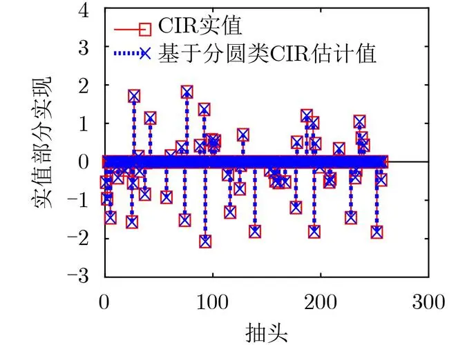

# 预备知识

## 1. 定位方法

位置信息可以通过使用多种测量来获得，包括但不限于射频（无线电频率 radio frequency RF，频率范围在3kHz到300GHz之间的一段电磁波频段）、声波、磁场和可见光测量。其中radio signals可以实现高精度定位。

*   基于时间——利用在节点之间以已知速度行进的RF信号的传输和/或接收时间
*   基于角度——利用RF信号的行进方向执行几何估计
*   基于指纹——执行物理和无线电环境之间的映射，其中参考无线电测量被视为相关物理位置的射频指纹

### 1. 基于时间的定位方法

*   **优点：**

    *   \*\*精度较高：\*\*通过精确测量信号的传播时间，可以获得较高的定位精度。
    *   \*\*原理简单：\*\*基于简单的物理原理，实现相对容易。

*   **缺点：**

    *   **易受多径效应影响：** 在复杂环境中，信号可能存在多条传播路径，导致测量误差。

    *   **非视距效应**：当发射机和接收机之间的直接路径（即视距 (<a href="zotero://open-pdf/library/items/K2BFBIIU?page=1">“line-of-sight”</a> LOS) 路径）被阻挡时，无线电信号通过反射解耦基于时间的测量（例如 ToF、TDoA）到达接收机，就会发生非视距传播。

        *   解决方案1：分类

            *   作用：分类结果可用于消除不需要的（即 NLOS 分类）测量，并仅利用 LOS 测量进行测距或定位
            *   方法：基于根据相关传播条件对无线电信号进行分类，包括概率模型统计假设检验、支持向量机SVM等机器学习模型等
            *   *分类方法可能无法利用测量中存在的全部信息进行测距。*

        *   解决方案2：回归

            *   作用：主要用于测距误差估计
            *   方法：从接收波形中提取的各种特征的测距误差估计或直接使用波形（防止丢失信息）基于信道脉冲响应（channel impulse response, CIR）进行测距误差估计

    *   **对同步要求较高：** 需要精确的时间同步，实现起来有一定难度。

        *   由于锚点和目标设备的独立运行时钟之间的时钟偏移未知，在无线现实世界测量中确定真实的 ToA 信息很困难。一种解决方法是利用双向测距（TWR）或往返时间（RTT）方案，其中不需要锚点和目标设备之间的同步。

    *   **成本较高：** 需要高精度的时钟设备。

*   ### 简单步骤

    *   检测发射的无线电信号到达接收器的时间，即到达时间（ToA）。
    *   ToA 可用于确定飞行时间 (ToF)，即无线电信号从发射器传输到接收器所需的时间。或者，可以减去 ToA 估计以获得到达时间差 (TDoA)。
    *   随后，ToF 或 TDoA 可用于测距和定位。

### 2. 基于角度的定位方法

*   **优点：**

    *   \*\*抗多径干扰能力强：\*\*通过多个天线接收信号，可以利用角度信息来抑制多径干扰。
    *   \*\*定位精度较高：\*\*角度信息可以提供额外的约束条件，提高定位精度。

*   **缺点：**

    *   \*\*对硬件要求较高：\*\*需要多个天线和角度测量设备。
    *   \*\*计算复杂度较高：\*\*角度估计算法相对复杂。
    *   \*\*易受遮挡影响：\*\*如果信号被遮挡，角度测量会受到影响。

### 3. 基于指纹的定位方法

*   **优点：**

    *   \*\*适应性强：\*\*可以适应各种复杂的室内环境，无需对环境进行精确建模。
    *   \*\*实现简单：\*\*只需要采集和存储信号强度指纹即可。

*   **缺点：**

    *   \*\*精度较低：\*\*指纹匹配的精度受限于指纹数据库的质量和数量。
    *   \*\*维护成本高（难以泛化）：\*\*需要定期更新指纹数据库，以适应环境变化。新场景要建立新的指纹数据库。
    *   \*\*易受干扰：\*\*环境变化（如家具移动）会影响指纹的稳定性。

应用场景和需求：

*   **对于需要高精度定位的应用**，基于时间或角度的定位方法更适合。
*   **对于复杂室内环境的定位**，基于指纹的定位方法更灵活。
*   **对于实时性要求高的应用**，基于时间的定位方法可能更具优势。

在实际应用中，往往会结合多种定位方法来提高定位精度和鲁棒性。例如，可以将基于时间的定位方法和基于指纹的定位方法结合起来，利用时间信息来校正指纹匹配的结果。

## 2. 通道脉冲响应（Channel Impulse Response，CIR）

**通道脉冲响应（CIR）** 是一个描述无线通信系统中脉冲信号在信道上所经历的畸变的数学模型。畸变包括衰减、多径传播、噪声等。CIR就是用来表征这些影响的数学模型。

*   脉冲信号：接近理想Dirac Delta函数的短时信号，在零时刻具有无限大的值，但在其他时刻为零。

### CIR的物理意义

*   \*\*多径效应：\*\*在无线环境中，信号从发射端到接收端会经过多条路径，这些路径的长度不同，导致到达接收端的时间不同，从而产生多径效应。CIR可以描述这些多径的幅度和延迟。
*   \*\*衰落：\*\*无线信道中的信号强度会随着时间和空间的变化而发生衰落，CIR可以描述这种衰落的特性。
*   \*\*噪声：\*\*无线信道中存在各种噪声，CIR也可以描述这些噪声对信号的影响。

### 3. CIR的数学表示

CIR 表征相应的通信信道，并包含有关脉冲信号从发射器到接收器的传播时间的信息。发射的信号可能从不同的路径到达接收器，例如直接路径、反射路径或衍射路径。

通常用一个复数序列$\mathrm{CIR}(t,\tau)$来表示CIR，其中的每一个取样值表示一个多径分量的复数幅度和相位。无线电信道的 CIR 可以相对于时间 $t$ 和时间延迟 $τ$ 表示为

$\mathrm{CIR}(t,\tau)=\sum_{i=1}^La_i(t)\chi_i(\tau-\tau_i(t)),$

*   $t$

    表示接收信号的绝对时间，$\tau$表示多径分量的延迟时间，可以固定前者让后者变化用来研究信道特性。

*   $L$表示(complex) amplitude（复）幅度 $a_i(t)$和delay延迟$\tau_i(t)$的multipath components多径分量的数量

    *   $a_i(t)=A_i(t)e^{j\phi_i(t)}$

        复数增益可以表现为复数形式

*   $\chi_i(·)$

    表示由于信道的有限带宽和传播机制（频率依赖性、漫散射和衍射等）以及滤波而偏离理想狄拉克-德尔塔函数的失真脉冲。即一个扩展的脉冲函数。

对此，ToA（第一个到达接收器的信号的到达时间）和TDoA可以表示为

$\widehat{\mathrm{ToA}}=f(\mathrm{CIR}),$

$\widehat{\mathrm{TDoA}}=g(\mathrm{CIR}_i,\mathrm{CIR}_j).$

### CIR的测量方法

*   \*\*基于导频的测量：\*\*发送已知的导频信号，通过接收到的信号来估计CIR。
*   \*\*基于盲估计的方法：\*\*不需要发送已知的导频信号，直接从接收到的信号中估计CIR。

## 4. ToA\&TDoA

### 传统估计器

*   **Peak**- 高于噪声阈值的 CIR 第一个峰值的延迟时间被视为 ToA

*   **IFP**- 在CIR曲线上，找到第一个超过噪声门限且曲率发生变化的采样点估计为 ToA

*   **LDE**- 将移动平均滤波器应用于 CIR，并且输出进一步并行通过两个不同的移动最大滤波器。高于噪声阈值的第一延迟时间，其中较小的移动最大滤波器（即具有较小窗口大小的移动最大滤波器）的输出超过较大移动最大滤波器的输出一个因子，即前沿检测因子，被确定为 ToA

*   **DWM**- DWM1000设备估计，并未提供估计细节 -- Decawave Ltd. DW1000 User Manual. Accessed: May 3, 2022. \[Online]. Available:<https://www.decawave.com/dw1000/usermanual/>

### 5. 减轻ToA\&TDoA误差

*   **CnstAvg**：该基准测试将 T(D)oA 误差建模为常数。通过取从一组参考测量获得的 T(D)oA 估计误差的平均值来计算常数值。
*   **Lasso**： Lasso 回归
*   **SVM**： 支持向量机，一种监督学习方法。从输入 CIR 中提取的特征来估计 T(D)oA 估计的误差

### 6. 使用ToA\&TDoA测距

$\widehat{R}=c\operatorname{\Delta}_{\boldsymbol{t}}(\widehat{\mathrm{ToA}}-\mathrm{ToT}).$ 这里，c、Δt 和 Rb 分别代表光速、CIR 的时间分辨率（即连续 CIR 指数之间的绝对时间间隔）和估计范围。

1.  使用**TWR**计算距离，**TWR**是一种用于测量两个节点之间距离的无线通信技术。它通过交换信号来消除时钟同步问题，从而提高测量精度。缺点是延迟高。**基本原理：**

    1.  **起始节点发送信号**：节点A向节点B发送一个信号。
    2.  **节点B接收并响应**：节点B接收到信号后，经过一个已知的延迟时间，向节点A发送一个响应信号。
    3.  **节点A接收响应**：节点A接收到响应信号后，记录整个过程的时间。
    4.  **计算距离**：通过已知的信号传播速度（光速）和总的往返时间，计算出节点A和节点B之间的距离。

2.  此外在多个设备彼此同步的情况下，可以利用基于 TDoA 的方案来消除确定 ToT 的需要，并且该方案延迟比TWR低很多。
